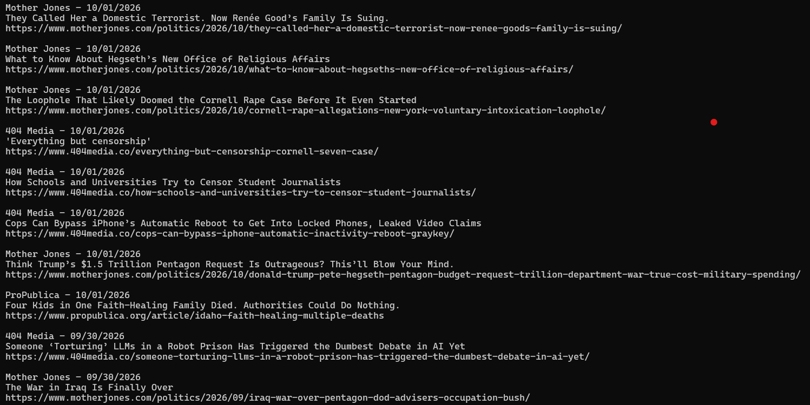

# Make the news come to you

Basic RSS is a lightweight RSS feed grabber. Instead of having to switch between every single news organization, blog, and daily comic in the world, grab the headlines straight from their RSS feeds, and make the news come to your terminal. Individual feed items are ordered by time and date of publication.

Edit feeds.txt with your preferred feeds, or stick with the presets. 